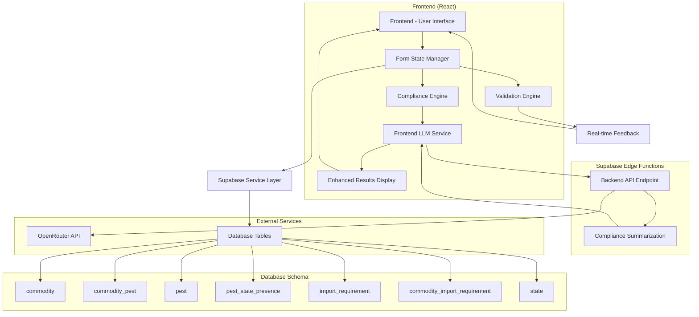
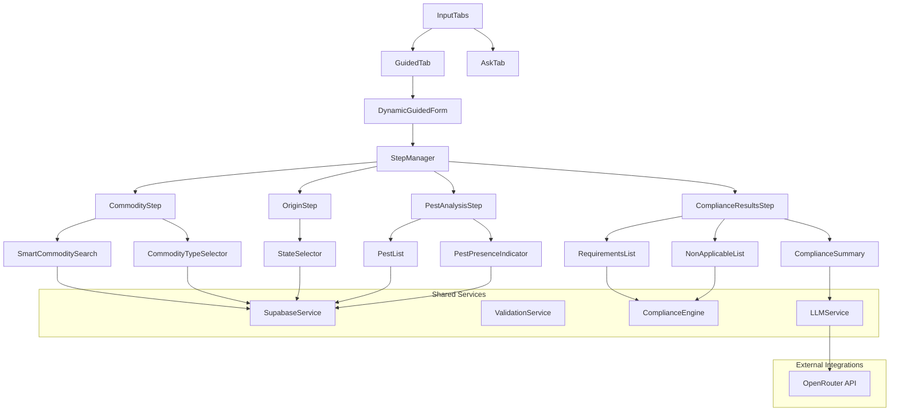

# Design Document

## Overview

The dynamic plant compliance form will replace the current static form with an intelligent, step-by-step wizard that guides users through the compliance checking process. The system will leverage the existing Supabase database schema to provide real-time validation, pest identification, and compliance determination. The design focuses on progressive disclosure, where each step builds upon the previous one, ensuring users only see relevant information at the right time.

### Enhanced Compliance Results with LLM Summarization

To improve user understanding of compliance results, the system will incorporate OpenRouter LLM integration for:
- **Intelligent Summarization:** Generate clear, concise summaries of compliance results in plain language
- **Contextual Explanations:** Provide easy-to-understand explanations of why certain requirements apply or don't apply
- **Graceful Degradation:** Display detailed requirements even when LLM service is unavailable
- **Error Handling:** Robust fallback mechanisms for LLM service failures

## Architecture

### High-Level Architecture



### Component Architecture



## Components and Interfaces

### Core Components

#### 1. InputTabs (Enhanced)
**Purpose:** Main container with two modes - extends existing InputTabs component
**Props:**
- `onSubmitGuided: (input: GuidedInput) => void`
- `onSubmitAsk: (input: AskInput) => void`
- `isLoading: boolean`

**Features:**
- Tab switching between "Guided" and "Ask" modes
- Maintains existing UI structure and styling
- Integrates new dynamic functionality

#### 2. DynamicGuidedForm (New)
**Purpose:** Replaces static guided form with dynamic step-by-step flow
**Features:**
- Progressive disclosure of form fields
- Real-time validation and database integration
- Smart commodity search with LLM assistance
- Automatic pest identification and presence checking

#### 3. StepManager (New)
**Purpose:** Manages dynamic form step transitions
**Props:**
- `steps: FormStep[]`
- `currentStep: number`
- `onStepChange: (step: number) => void`
- `canProceed: boolean`

#### 4. CommodityStep (New)
**Purpose:** Enhanced commodity selection with database integration
**Features:**
- Real-time search against Supabase commodity table
- Type disambiguation (fruits/vegetables vs plants/trees)
- LLM-powered suggestions for ambiguous inputs
- Validation against existing database entries

#### 5. OriginStep (New)
**Purpose:** Origin state selection with pest context
**Features:**
- State dropdown (reuses existing AUSTRALIAN_STATES)
- Shows pest presence context for selected commodity
- Integration with pest_state_presence table

#### 6. PestAnalysisStep (New)
**Purpose:** Displays identified pests and their geographic presence
**Features:**
- Automatic pest lookup via commodity_pest table
- Visual indicators for pest presence in origin state
- Zoned status display from pest_state_presence
- Clear explanations of pest risks

#### 7. ComplianceSummary (New)
**Purpose:** Displays LLM-generated summary of compliance results
**Features:**
- Shows AI-generated plain language summary above detailed requirements
- Graceful fallback when LLM service is unavailable
- Clear, concise explanation of overall compliance situation
- Integration with OpenRouter API for summary generation

### Service Layer Interfaces

#### SupabaseService
```typescript
interface SupabaseService {
  searchCommodities(query: string): Promise<Commodity[]>
  getCommodityPests(commodityId: number): Promise<Pest[]>
  getPestPresence(pestIds: number[], stateId: number): Promise<PestPresence[]>
  getImportRequirements(commodityId: number): Promise<ImportRequirement[]>
  getStates(): Promise<State[]>
}
```

#### ValidationService
```typescript
interface ValidationService {
  validateCommodity(input: string): ValidationResult
  validateStateSelection(state: string): ValidationResult
  validateFormCompletion(data: FormData): ValidationResult
}
```

#### ComplianceEngine
```typescript
interface ComplianceEngine {
  analyzeCompliance(data: FormData): Promise<ComplianceResult>
  determineApplicableRequirements(
    commodity: Commodity,
    pests: Pest[],
    pestPresence: PestPresence[],
    requirements: ImportRequirement[]
  ): ApplicableRequirement[]
  determineNonApplicableRequirements(
    requirements: ImportRequirement[],
    applicable: ApplicableRequirement[]
  ): NonApplicableRequirement[]
}
```

#### LLMService
```typescript
interface LLMService {
  generateComplianceSummary(
    complianceResult: ComplianceResult,
    formData: FormData
  ): Promise<string>
  isAvailable(): boolean
}

interface ComplianceSummaryRequest {
  commodity: string
  origin: string
  destination: string
  applicableRequirements: ApplicableRequirement[]
  nonApplicableRequirements: NonApplicableRequirement[]
  pestContext: {
    identifiedPests: Pest[]
    pestsPresent: Pest[]
    pestsAbsent: Pest[]
  }
}
```

## Data Models

### Form Data Structure
```typescript
interface FormData {
  commodity?: {
    id: number
    name: string
    type: string
  }
  origin?: {
    stateId: number
    stateName: string
  }
  destination: {
    stateId: number // Fixed to Tasmania for POC
    stateName: "Tasmania"
  }
  pests?: Pest[]
  pestPresence?: PestPresence[]
}

interface Pest {
  pest_id: number
  name: string
  acronym: string
}

interface PestPresence {
  pest_id: number
  state_id: number
  zoned: boolean
}

interface ComplianceResult {
  applicable: ApplicableRequirement[]
  nonApplicable: NonApplicableRequirement[]
  summary?: string // LLM-generated summary, optional if service unavailable
}

interface ApplicableRequirement {
  requirement: ImportRequirement
  reason: string
  source: string
  actions: string[]
}

interface NonApplicableRequirement {
  requirement: ImportRequirement
  reason: string
}
```

### Database Integration
The system will integrate with the existing Supabase schema:
- `commodity` table for commodity validation and type disambiguation
- `commodity_pest` table for pest associations
- `pest` table for pest information
- `pest_state_presence` table for geographic pest distribution
- `import_requirement` and `commodity_import_requirement` for compliance rules
- `state` table for state information

## Error Handling

### Validation Errors
- **Commodity not found:** Display suggestions based on partial matches
- **Invalid state selection:** Highlight valid options
- **Network errors:** Retry mechanism with user feedback
- **Database errors:** Graceful degradation with cached data where possible

### User Experience Errors
- **Step navigation errors:** Prevent invalid step transitions
- **Data consistency errors:** Validate data integrity between steps
- **LLM service errors:** Graceful fallback to display requirements without summary
- **Timeout errors:** Save progress and allow resumption

### Error Recovery Strategies
1. **Progressive Enhancement:** Core functionality works without JavaScript
2. **Offline Support:** Cache common data for offline validation
3. **Graceful Degradation:** Fall back to simpler form if dynamic features fail
4. **User Guidance:** Clear error messages with actionable solutions

## Testing Strategy

### Unit Testing
- **Component Testing:** Each form step component with various input scenarios
- **Service Testing:** Database service methods with mock data
- **Validation Testing:** All validation rules with edge cases
- **Engine Testing:** Compliance logic with various commodity/pest combinations

### Integration Testing
- **Database Integration:** Real Supabase queries with test data
- **Step Flow Testing:** Complete user journeys through the form
- **Error Handling:** Network failures and invalid data scenarios
- **Performance Testing:** Response times for database queries

### End-to-End Testing
- **User Journey Testing:** Complete flows from commodity entry to results
- **Cross-browser Testing:** Compatibility across modern browsers
- **Mobile Testing:** Responsive design and touch interactions
- **Accessibility Testing:** Screen reader compatibility and keyboard navigation

### Test Data Strategy
- **Mock Data:** Comprehensive test datasets for all commodity types
- **Edge Cases:** Unusual commodity names, multiple pest associations
- **Performance Data:** Large datasets to test query optimization
- **Error Scenarios:** Invalid data combinations and network failures

## Performance Considerations

### Database Optimization
- **Query Optimization:** Efficient joins between commodity, pest, and requirement tables
- **Indexing Strategy:** Proper indexes on frequently queried columns
- **Caching Layer:** Cache common queries (states, common commodities)
- **Connection Pooling:** Efficient database connection management

### Frontend Performance
- **Code Splitting:** Lazy load form steps to reduce initial bundle size
- **Debounced Search:** Prevent excessive API calls during commodity search
- **Memoization:** Cache expensive calculations and API responses
- **Progressive Loading:** Show partial results while loading additional data

### User Experience Performance
- **Optimistic Updates:** Show immediate feedback before server confirmation
- **Skeleton Loading:** Display loading states that match final content structure
- **Error Boundaries:** Prevent component crashes from affecting entire form
- **Accessibility Performance:** Ensure screen reader announcements don't overwhelm users

## Security Considerations

### Security Considerations

#### API Key Security and Architecture
- **Supabase Edge Functions:** Use Supabase Edge Functions as secure backend to proxy OpenRouter API requests
- **Environment Variables:** Store OpenRouter API key securely in Supabase Edge Function environment (OPENROUTER_API_KEY)
- **Proxy Pattern:** Edge Function validates and sanitizes requests before forwarding to OpenRouter API
- **Rate Limiting:** Implement rate limiting within Edge Function to prevent abuse and cost overruns
- **CORS Configuration:** Properly configure CORS in Edge Function for frontend access
- **Request Validation:** Edge Function validates request structure and content before API calls
- **Error Handling:** Edge Function provides consistent error responses without exposing sensitive details

#### Basic Security
- **Input Validation:** Validate user inputs before database queries and LLM requests
- **Supabase Security:** Use Supabase's built-in security features
- **Request Sanitization:** Sanitize all data sent to OpenRouter API to prevent injection attacks
- **Error Handling:** Avoid exposing sensitive information in error messages
