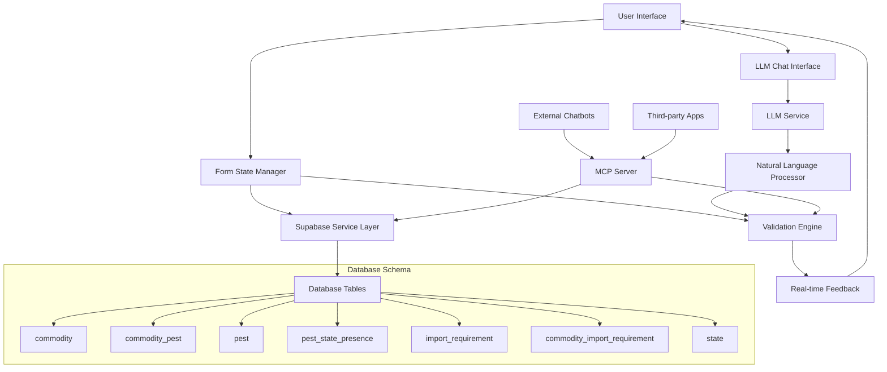
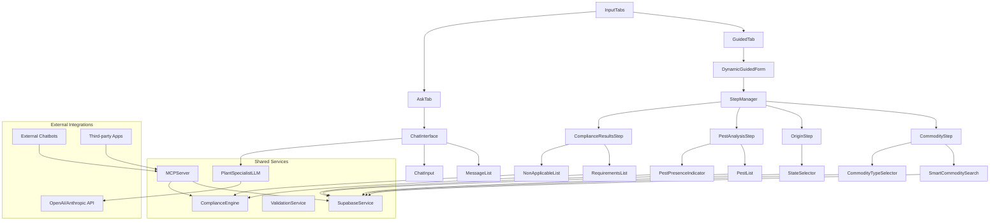

# Design Document

## Overview

The dynamic plant compliance form will replace the current static form with an intelligent, step-by-step wizard that guides users through the compliance checking process. The system will leverage the existing Supabase database schema to provide real-time validation, pest identification, and compliance determination. The design focuses on progressive disclosure, where each step builds upon the previous one, ensuring users only see relevant information at the right time.

### Enhanced User Experience with LLM Integration

To maximize user-friendliness, the system will incorporate LLM capabilities for:
- **Natural Language Processing:** Users can describe their commodity in plain English (e.g., "I'm moving some apple trees from my orchard")
- **Intelligent Disambiguation:** LLM helps clarify ambiguous inputs and suggests corrections
- **Contextual Guidance:** Provides explanations and guidance throughout the process
- **Conversational Interface:** Alternative chat-based interface alongside the structured form

### MCP Server Integration

The system will expose its functionality through a Model Context Protocol (MCP) server, enabling:
- **Chatbot Integration:** General-purpose chatbots can access plant compliance data
- **API Standardization:** Consistent interface for external systems
- **Extensibility:** Easy integration with other agricultural or regulatory systems
- **Developer Access:** Third-party applications can leverage the compliance engine

## Architecture

### High-Level Architecture



### Component Architecture



## Components and Interfaces

### Core Components

#### 1. InputTabs (Enhanced)
**Purpose:** Main container with two modes - extends existing InputTabs component
**Props:**
- `onSubmitGuided: (input: GuidedInput) => void`
- `onSubmitAsk: (input: AskInput) => void`
- `isLoading: boolean`

**Features:**
- Tab switching between "Guided" and "Ask" modes
- Maintains existing UI structure and styling
- Integrates new dynamic functionality

#### 2. DynamicGuidedForm (New)
**Purpose:** Replaces static guided form with dynamic step-by-step flow
**Features:**
- Progressive disclosure of form fields
- Real-time validation and database integration
- Smart commodity search with LLM assistance
- Automatic pest identification and presence checking

#### 3. StepManager (New)
**Purpose:** Manages dynamic form step transitions
**Props:**
- `steps: FormStep[]`
- `currentStep: number`
- `onStepChange: (step: number) => void`
- `canProceed: boolean`

#### 4. CommodityStep (New)
**Purpose:** Enhanced commodity selection with database integration
**Features:**
- Real-time search against Supabase commodity table
- Type disambiguation (fruits/vegetables vs plants/trees)
- LLM-powered suggestions for ambiguous inputs
- Validation against existing database entries

#### 5. OriginStep (New)
**Purpose:** Origin state selection with pest context
**Features:**
- State dropdown (reuses existing AUSTRALIAN_STATES)
- Shows pest presence context for selected commodity
- Integration with pest_state_presence table

#### 6. PestAnalysisStep (New)
**Purpose:** Displays identified pests and their geographic presence
**Features:**
- Automatic pest lookup via commodity_pest table
- Visual indicators for pest presence in origin state
- Zoned status display from pest_state_presence
- Clear explanations of pest risks

#### 7. ChatInterface (Enhanced)
**Purpose:** Enhanced "Ask" tab with plant specialist LLM
**Features:**
- Replaces simple textarea with conversational interface
- Plant specialist persona with domain expertise
- Integration with compliance database for accurate responses
- Ability to hand off to guided form when appropriate

#### 8. PlantSpecialistLLM (New)
**Purpose:** LLM service configured as plant movement specialist
**Features:**
- Domain-specific prompting for plant compliance
- Integration with Supabase data for accurate responses
- Conversational interface for complex queries
- Structured data extraction from natural language

### Service Layer Interfaces

#### SupabaseService
```typescript
interface SupabaseService {
  searchCommodities(query: string): Promise<Commodity[]>
  getCommodityPests(commodityId: number): Promise<Pest[]>
  getPestPresence(pestIds: number[], stateId: number): Promise<PestPresence[]>
  getImportRequirements(commodityId: number): Promise<ImportRequirement[]>
  getStates(): Promise<State[]>
}
```

#### ValidationService
```typescript
interface ValidationService {
  validateCommodity(input: string): ValidationResult
  validateStateSelection(state: string): ValidationResult
  validateFormCompletion(data: FormData): ValidationResult
}
```

#### ComplianceEngine
```typescript
interface ComplianceEngine {
  analyzeCompliance(data: FormData): Promise<ComplianceResult>
  determineApplicableRequirements(
    commodity: Commodity,
    pests: Pest[],
    pestPresence: PestPresence[],
    requirements: ImportRequirement[]
  ): ApplicableRequirement[]
  determineNonApplicableRequirements(
    requirements: ImportRequirement[],
    applicable: ApplicableRequirement[]
  ): NonApplicableRequirement[]
}
```

#### LLMService
```typescript
interface LLMService {
  processNaturalLanguageInput(input: string): Promise<ParsedInput>
  generateClarifyingQuestions(context: Partial<FormData>): Promise<string[]>
  disambiguateCommodity(input: string, matches: Commodity[]): Promise<DisambiguationResult>
  explainRequirements(requirements: ApplicableRequirement[]): Promise<string>
  generateConversationalResponse(context: ConversationContext): Promise<string>
}

interface ParsedInput {
  commodity?: string
  origin?: string
  destination?: string
  confidence: number
  needsClarification: string[]
}

interface DisambiguationResult {
  suggestedCommodity: Commodity
  explanation: string
  alternatives: Commodity[]
}
```

#### MCPServer
```typescript
interface MCPServer {
  // MCP Tool Definitions
  searchCommodities(query: string): Promise<Commodity[]>
  validateCommodity(commodityName: string): Promise<ValidationResult>
  getPestsForCommodity(commodityId: number): Promise<Pest[]>
  checkPestPresence(pestIds: number[], stateId: number): Promise<PestPresence[]>
  getComplianceRequirements(
    commodityId: number,
    originStateId: number,
    destinationStateId: number
  ): Promise<ComplianceResult>
  explainRequirement(requirementId: number): Promise<string>
}
```

## Data Models

### Form Data Structure
```typescript
interface FormData {
  commodity?: {
    id: number
    name: string
    type: string
  }
  origin?: {
    stateId: number
    stateName: string
  }
  destination: {
    stateId: number // Fixed to Tasmania for POC
    stateName: "Tasmania"
  }
  pests?: Pest[]
  pestPresence?: PestPresence[]
}

interface Pest {
  pest_id: number
  name: string
  acronym: string
}

interface PestPresence {
  pest_id: number
  state_id: number
  zoned: boolean
}

interface ComplianceResult {
  applicable: ApplicableRequirement[]
  nonApplicable: NonApplicableRequirement[]
  summary: string
}

interface ApplicableRequirement {
  requirement: ImportRequirement
  reason: string
  source: string
  actions: string[]
}

interface NonApplicableRequirement {
  requirement: ImportRequirement
  reason: string
}
```

### Database Integration
The system will integrate with the existing Supabase schema:
- `commodity` table for commodity validation and type disambiguation
- `commodity_pest` table for pest associations
- `pest` table for pest information
- `pest_state_presence` table for geographic pest distribution
- `import_requirement` and `commodity_import_requirement` for compliance rules
- `state` table for state information

## Error Handling

### Validation Errors
- **Commodity not found:** Display suggestions based on partial matches
- **Invalid state selection:** Highlight valid options
- **Network errors:** Retry mechanism with user feedback
- **Database errors:** Graceful degradation with cached data where possible

### User Experience Errors
- **Step navigation errors:** Prevent invalid step transitions
- **Data consistency errors:** Validate data integrity between steps
- **Timeout errors:** Save progress and allow resumption

### Error Recovery Strategies
1. **Progressive Enhancement:** Core functionality works without JavaScript
2. **Offline Support:** Cache common data for offline validation
3. **Graceful Degradation:** Fall back to simpler form if dynamic features fail
4. **User Guidance:** Clear error messages with actionable solutions

## Testing Strategy

### Unit Testing
- **Component Testing:** Each form step component with various input scenarios
- **Service Testing:** Database service methods with mock data
- **Validation Testing:** All validation rules with edge cases
- **Engine Testing:** Compliance logic with various commodity/pest combinations

### Integration Testing
- **Database Integration:** Real Supabase queries with test data
- **Step Flow Testing:** Complete user journeys through the form
- **Error Handling:** Network failures and invalid data scenarios
- **Performance Testing:** Response times for database queries

### End-to-End Testing
- **User Journey Testing:** Complete flows from commodity entry to results
- **Cross-browser Testing:** Compatibility across modern browsers
- **Mobile Testing:** Responsive design and touch interactions
- **Accessibility Testing:** Screen reader compatibility and keyboard navigation

### Test Data Strategy
- **Mock Data:** Comprehensive test datasets for all commodity types
- **Edge Cases:** Unusual commodity names, multiple pest associations
- **Performance Data:** Large datasets to test query optimization
- **Error Scenarios:** Invalid data combinations and network failures

## Performance Considerations

### Database Optimization
- **Query Optimization:** Efficient joins between commodity, pest, and requirement tables
- **Indexing Strategy:** Proper indexes on frequently queried columns
- **Caching Layer:** Cache common queries (states, common commodities)
- **Connection Pooling:** Efficient database connection management

### Frontend Performance
- **Code Splitting:** Lazy load form steps to reduce initial bundle size
- **Debounced Search:** Prevent excessive API calls during commodity search
- **Memoization:** Cache expensive calculations and API responses
- **Progressive Loading:** Show partial results while loading additional data

### User Experience Performance
- **Optimistic Updates:** Show immediate feedback before server confirmation
- **Skeleton Loading:** Display loading states that match final content structure
- **Error Boundaries:** Prevent component crashes from affecting entire form
- **Accessibility Performance:** Ensure screen reader announcements don't overwhelm users

## Security Considerations

### Basic Security
- **Input Validation:** Validate user inputs before database queries
- **Supabase Security:** Use Supabase's built-in security features
- **API Key Management:** Secure handling of Supabase and LLM API credentials
